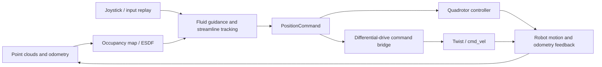

# FLORE

**English** | [简体中文](README.zh-CN.md)

## Overview

FLORE is a robot navigation project based on fluid-inspired guiding vector fields (GVFs). A joystick or a prerecorded input trace supplies a desired direction and speed. The system combines that intent with obstacle geometry from point clouds to generate navigation commands in real time.

The project supports two platforms:

- **3D quadrotor:** solves a potential-flow field in a local 3D map and uses streamline tracking to generate horizontal and vertical motion around, over, and under obstacles.
- **2D differential-drive robot:** solves a planar stream-function field and converts world-frame velocity commands into forward speed and angular velocity.

The repository includes simulation, input replay, RViz visualization, rosbag recording, and metric plots. The core uses C++14, ROS Noetic, Eigen, and PCL; experiment tools use Python and Bash.

## Architecture



| Component | Directory | Responsibility |
| --- | --- | --- |
| Fluid planner | `src/Planner/fluid` | 2D/3D numerical solvers, guidance, ROS command scheduling, and field visualization |
| Map environment | `src/Planner/plan_env` | Point-cloud ingestion, occupancy and ESDF construction, and obstacle-distance queries |
| Input | `src/Interface/human_input_sim`, `src/Interface/joystick_drivers` | Convert joystick input or YAML traces into `/human_intent` velocity commands |
| Simulation and bridges | `src/Interface` | Quadrotor, differential-drive, and B2 simulation; `PositionCommand` to `Twist` conversion |
| Quadrotor control | `src/Controller/drone_control` | PX4 hardware integration |
| Experiment tools | `scripts` | Scenario generation, closed-loop runs, recording, metrics, and plotting |
| Container environment | `docker` | ROS Noetic dependencies and a VNC desktop |

The main planning node is `formation_planning`. Inside it, `gvf_manager.cpp` manages input and command scheduling, `gvf.cpp` connects ROS to the algorithms, and `fluid_guidance.cpp` implements guidance. Numerical solvers live in `fluid_solver_2d.cpp` and `fluid_solver_3d.cpp`. The algorithms query the map through a distance interface, solve coarse and fine local fields, and cache the results for control callbacks.

Main simulation topics:

| Topic | Content |
| --- | --- |
| `/sim/local_map` | Local obstacle point cloud |
| `/sim/odom` | Robot position, orientation, and velocity |
| `/human_intent` | Human velocity intent in the world frame |
| `/position_cmd` | Planner output as `PositionCommand` |
| `/cmd_vel` | Forward and angular velocity from the differential-drive bridge |

## Getting started

### 1. Prepare the project and container

The host needs Linux, Docker, and permission for the current user to access Docker. ROS and build dependencies are installed in the container. Software rendering is enabled by default, so neither a GPU nor a physical joystick is required.

```bash
git clone --branch dev https://github.com/Chenwill1899/FLORE.git
cd FLORE

# Start the project container; build the image automatically if it is missing.
./scripts/ros1_docker.sh start
```

For an existing checkout, work from your local `FLORE` directory.

The default image is `flore:noetic-vnc`, and the container is `flore-noetic`. The project is mounted at the same absolute path inside the container, so source files and run outputs remain in the host checkout. The container uses an isolated network for ROS.

### 2. Run a benchmark

From the project directory on the host:

```bash
./scripts/run_sim_paper.sh 3d   # Quadrotor
./scripts/run_sim_paper.sh 2d   # Differential-drive robot
```

The script enters the container automatically and builds the workspace on the first run if needed. Omitting the mode selects `3d`. Run only one benchmark per workspace at a time.

| Mode | Default scenario | Default input and motion |
| --- | --- | --- |
| `3d` | Mixed 3D pillar forest generated from `pillar_forest_mixed.yaml` | Starts at `(-1, 13.4, 1)`, holds world -Y intent, and releases after 20 seconds |
| `2d` | The repository's `pillar.pcd` map | Starts at `(2, 13.4, 0)` facing -Y, holds a 1 m/s intent, and releases after 40 seconds |

In the default RViz view, world -Y appears as left-to-right motion. Both default traces keep the input direction fixed; the navigation algorithm supplies obstacle-avoidance steering. The 2D trace is `diff_drive_crossing_v1.yaml`, and the 3D trace is `pillar_forest_crossing_v1.yaml`.

The script starts the ROS master, simulator, planner, and input replay, records data, and generates plots and metrics when the run ends. Press `Ctrl+C` to stop a run early.

### 3. View RViz

Connect a VNC client to **`127.0.0.1:5902`**, with no password, to see the global and following RViz views. The port is bound only to the host's loopback interface.

For a headless run:

```bash
BENCHMARK_ENABLE_RVIZ=false ./scripts/run_sim_paper.sh 2d
# The same option works with 3d.
```

### 4. Open a shell, rebuild, or stop

Run these commands from the project directory on the host:

```bash
./scripts/ros1_docker.sh shell     # Open an interactive shell with ROS configured.
./scripts/ros1_docker.sh compile   # Rebuild after C++ changes; defaults to four jobs.
./scripts/ros1_docker.sh logs      # Show container desktop startup logs.
./scripts/ros1_docker.sh stop      # Stop the project container.
```

Inside the container, you can also run `./scripts/run_sim_paper.sh 2d` or `3d` directly. After changing the Dockerfile, run `./scripts/ros1_docker.sh build`, remove the stopped old container, and run `start` again.

Override the container name, image, VNC port, or build concurrency with `FLORE_DOCKER_CONTAINER`, `FLORE_IMAGE`, `FLORE_VNC_PORT`, and `FLORE_BUILD_JOBS`, respectively.

### 5. Configure experiments

Experiment environment variables are forwarded from the host into the container. For example:

```bash
# 3D force-pulse experiment.
SIM_PAPER_DISTURBANCE_MODE=noise ./scripts/run_sim_paper.sh 3d

# 3D fixed-reference streamline with a force pulse.
SIM_PAPER_EXPERIMENT_MODE=fixed SIM_PAPER_DISTURBANCE_MODE=noise \
  ./scripts/run_sim_paper.sh 3d

# Change the differential-drive intent speed limit.
BENCHMARK_GVF_EXTRA_ARGS="v_max:=0.8" ./scripts/run_sim_paper.sh 2d
```

| Environment variable | Purpose |
| --- | --- |
| `SIM_PAPER_SCENARIO` | Scenario YAML used to generate the map |
| `BENCHMARK_MAP` | PCD map; in 2D, a supplied scenario YAML takes precedence and generates the map |
| `BENCHMARK_TRACE_FILE` | Input replay YAML; the final event must release the input |
| `BENCHMARK_SIM_EXTRA_ARGS` | Extra simulator launch arguments, such as the starting position |
| `BENCHMARK_GVF_EXTRA_ARGS` | Extra planner launch arguments, such as speed limits |
| `BENCHMARK_LOG_DIR` | Output directory |

Keep paths inside the mounted project directory. When changing maps, also choose a suitable starting position and input trace. When changing speed, adjust replay duration accordingly. Extra launch arguments are space-separated `name:=value` pairs and replace the mode's default extra-argument string.

The 3D disturbance modes are `none`, `pulse`, and `noise`; experiment modes are `online` and `fixed`. These options apply only to 3D. The `fixed` experiment uses its own map and replay.

### 6. Inspect results

Outputs are saved under `logs/sim_paper/<2d|3d>/<timestamp>/` by default:

```text
<timestamp>/
├── metadata.txt          # Mode, code revision, run, and exit information
├── benchmark.bag         # Recorded ROS topics
├── benchmark_plot.png    # Trajectory and velocity plots
├── metrics.json          # Numerical metrics
├── summary.txt           # Metric summary
├── config/               # Map, replay, and ROS parameter snapshots
├── data/                 # Actual trajectory, commands, input, and other CSV files
└── raw/                  # Process and plotting logs
```

Experiment outputs and catkin build artifacts are excluded from Git.
