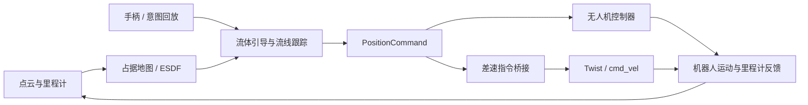

# FLORE

[English](README.md) | **简体中文**

## 项目是什么

FLORE 是一个基于流体引导场（GVF）的机器人导航项目。人通过手柄或预设回放给出运动方向和速度，系统结合点云中的障碍几何，实时生成绕障运动指令。

项目支持两种导航模式：

- **3D 无人机**：在三维局部地图中求解势流场，结合流线跟踪生成水平与垂直速度，实现绕行、翻越和下穿。
- **2D 差速车**：在平面上求解流函数引导场，将世界坐标系中的速度指令转换为差速车的前进速度和转向角速度。

项目包含仿真、意图回放、RViz 可视化、rosbag 录制和指标绘图。核心代码使用 C++14，基于 ROS Noetic、Eigen 和 PCL；实验脚本使用 Python 和 Bash。

## 架构



| 模块 | 目录 | 职责 |
| --- | --- | --- |
| 流体规划 | `src/Planner/fluid` | 2D/3D 数值求解、引导策略、ROS 指令调度与流场可视化 |
| 地图环境 | `src/Planner/plan_env` | 接收点云，构建占据地图和 ESDF，提供障碍距离查询 |
| 输入 | `src/Interface/human_input_sim`、`src/Interface/joystick_drivers` | 将手柄或 YAML 回放转换为 `/human_intent` 速度意图 |
| 仿真与桥接 | `src/Interface` | 四旋翼、差速车和 B2 仿真，以及 `PositionCommand` 到 `Twist` 的转换 |
| 无人机控制 | `src/Controller/drone_control` | PX4 实机控制接入 |
| 实验工具 | `scripts` | 场景生成、闭环运行、录制、指标计算与绘图 |
| 容器环境 | `docker` | ROS Noetic 依赖与 VNC 桌面 |

核心规划节点为 `formation_planning`。其内部由 `gvf_manager.cpp` 负责输入和指令调度，`gvf.cpp` 连接 ROS 与算法，`fluid_guidance.cpp` 实现引导策略，`fluid_solver_2d.cpp` 和 `fluid_solver_3d.cpp` 实现数值求解。算法通过距离查询接口读取地图，采用粗细两层局部求解，并缓存流场供控制回调采样。

仿真中的主要话题为：

| 话题 | 内容 |
| --- | --- |
| `/sim/local_map` | 局部障碍点云 |
| `/sim/odom` | 机器人位置、姿态和速度 |
| `/human_intent` | 人的世界系速度意图 |
| `/position_cmd` | 规划器输出的 `PositionCommand` |
| `/cmd_vel` | 差速桥接输出的前进速度和转向角速度 |

## 如何运行

### 1. 准备项目与容器

宿主机需要 Linux、Docker，以及当前用户访问 Docker 的权限。ROS 和编译依赖均安装在容器中，默认使用软件渲染，无需 GPU 或实体手柄。

```bash
git clone --branch dev https://github.com/Chenwill1899/FLORE.git
cd FLORE

# 启动本项目容器；镜像不存在时会自动构建
./scripts/ros1_docker.sh start
```

已有项目请直接进入本地 `FLORE` 目录操作。

默认镜像为 `flore:noetic-vnc`，容器为 `flore-noetic`。项目以相同的绝对路径挂载进容器，代码和运行结果都保存在宿主机项目目录中。容器使用独立网络运行 ROS。

### 2. 运行 benchmark

在宿主机的项目目录中选择一种模式运行：

```bash
./scripts/run_sim_paper.sh 3d   # 无人机
./scripts/run_sim_paper.sh 2d   # 差速车
```

脚本自动进入容器执行；首次运行时若工作空间尚未编译，会自动编译。不传模式参数时默认运行 `3d`。同一工作空间一次运行一个 benchmark。

| 模式 | 默认场景 | 默认输入与运动方向 |
| --- | --- | --- |
| `3d` | `pillar_forest_mixed.yaml` 生成的混合 3D 柱林 | 从 `(-1, 13.4, 1)` 出发，持续向世界 -Y 给出意图，20 秒后松杆 |
| `2d` | 仓库内的 `pillar.pcd` 柱林 | 从 `(2, 13.4, 0)` 朝 -Y 出发，以 1 m/s 意图持续前进，40 秒后松杆 |

在默认 RViz 视角中，世界 -Y 对应画面从左到右。两个默认回放均保持单一方向的意图，绕障转向由导航系统产生。2D 使用 `diff_drive_crossing_v1.yaml`，3D 使用 `pillar_forest_crossing_v1.yaml`。

脚本会依次启动 ROS Master、仿真器、规划器和意图回放，录制实验数据，结束后生成图表与指标。按 `Ctrl+C` 可提前结束运行。

### 3. 查看 RViz

用 VNC 客户端连接 **`127.0.0.1:5902`**，无需密码，即可查看容器中的 RViz 全局视角和跟随视角。该端口只绑定宿主机回环地址。

无需显示界面时：

```bash
BENCHMARK_ENABLE_RVIZ=false ./scripts/run_sim_paper.sh 2d
# 同样适用于 3d
```

### 4. 进入容器、编译和停止

以下命令在宿主机的项目目录中执行：

```bash
./scripts/ros1_docker.sh shell     # 进入已配置 ROS 的交互终端
./scripts/ros1_docker.sh compile   # 修改 C++ 后重新编译，默认使用 4 个编译任务
./scripts/ros1_docker.sh logs      # 查看容器桌面启动日志
./scripts/ros1_docker.sh stop      # 停止本项目容器
```

进入容器后，也可以直接执行 `./scripts/run_sim_paper.sh 2d` 或 `3d`。修改 Dockerfile 后，执行 `./scripts/ros1_docker.sh build` 重建镜像，再删除已停止的旧容器并重新 `start`。

容器名称、镜像、VNC 端口和编译并行数可分别通过 `FLORE_DOCKER_CONTAINER`、`FLORE_IMAGE`、`FLORE_VNC_PORT` 和 `FLORE_BUILD_JOBS` 设置。

### 5. 切换实验配置

环境变量会从宿主机传入容器。例如：

```bash
# 3D 力脉冲实验
SIM_PAPER_DISTURBANCE_MODE=noise ./scripts/run_sim_paper.sh 3d

# 3D 固定参考流线与力脉冲实验
SIM_PAPER_EXPERIMENT_MODE=fixed SIM_PAPER_DISTURBANCE_MODE=noise \
  ./scripts/run_sim_paper.sh 3d

# 调整差速车意图速度上限
BENCHMARK_GVF_EXTRA_ARGS="v_max:=0.8" ./scripts/run_sim_paper.sh 2d
```

| 环境变量 | 用途 |
| --- | --- |
| `SIM_PAPER_SCENARIO` | 指定用于生成地图的场景 YAML |
| `BENCHMARK_MAP` | 指定 PCD 地图；2D 同时指定场景 YAML 时优先生成场景地图 |
| `BENCHMARK_TRACE_FILE` | 指定意图回放 YAML，最后一条事件需将输入归零 |
| `BENCHMARK_SIM_EXTRA_ARGS` | 覆盖仿真 launch 额外参数，如起点位置 |
| `BENCHMARK_GVF_EXTRA_ARGS` | 覆盖规划 launch 额外参数，如速度上限 |
| `BENCHMARK_LOG_DIR` | 指定结果目录 |

路径应位于挂载的项目目录内。切换地图时，同步设置适合该场景的起点和回放；修改速度时，相应调整回放时长。额外 launch 参数以空格分隔 `name:=value`，会替换该模式默认的额外参数串。

3D 扰动模式支持 `none`、`pulse`、`noise`，实验模式支持 `online`、`fixed`；这些选项仅适用于 3D，其中 `fixed` 使用专用地图和回放。

### 6. 查看运行结果

默认结果目录为 `logs/sim_paper/<2d|3d>/<时间戳>/`：

```text
<时间戳>/
├── metadata.txt          # 模式、代码版本、运行与退出信息
├── benchmark.bag         # ROS 话题录制
├── benchmark_plot.png    # 轨迹与速度图表
├── metrics.json          # 数值指标
├── summary.txt           # 指标摘要
├── config/               # 地图、回放及 ROS 参数快照
├── data/                 # 实际轨迹、规划指令、意图等 CSV
└── raw/                  # 各进程与绘图日志
```

实验结果与 catkin 构建产物已加入 Git 忽略规则。
